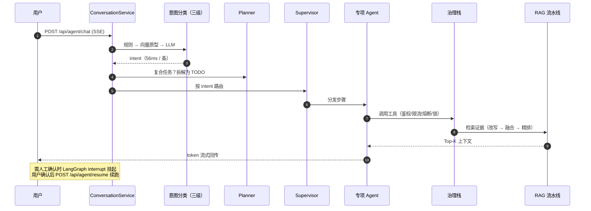

# 论匠 · LunJiang

<div align="center">

**多智能体驱动的毕业论文 / 学术论文全流程辅助平台**

*Multi-Agent Platform for the Full Academic Writing Lifecycle*

`选题` · `文献` · `写作` · `格式` · `查重` · `AI 检测`
一个 Supervisor 调度六类专项 Agent，覆盖从开题到答辩的完整链路

<br/>


**本地优先** · 对话与嵌入均走 Ollama（`qwen3:4b-ctx4096` + `bge-m3`），断网可跑，数据不出本机

</div>

---

## 目录 Table of Contents

| | |
| :--- | :--- |
| [一、项目简介 Introduction](#intro) | [七、目录结构 Project Layout](#layout) |
| [二、核心特性 Core Features](#features) | [八、API 速览 API Overview](#api) |
| [三、系统架构 Architecture](#architecture) | [九、评测与基线 Evaluation](#evaluation) |
| [四、快速开始 Quick Start](#quickstart) | [十、文档导航 Documentation](#docs) |
| [五、配置说明 Configuration](#configuration) | [十一、贡献指南 Contributing](#contributing) |
| [六、知识库使用 Knowledge Base](#knowledge) | [十二、常见问题 FAQ](#faq) · [十三、许可证 License](#license) |

---

<a id="intro"></a>

## 一、项目简介 Introduction

论匠把「写一篇论文」拆成一条可编排、可观测、可治理的工程流水线，而不是一个单纯聊天的对话框。

| 论文写作的真实痛点 | 论匠的解法 |
| :--- | :--- |
| 通用大模型不了解**你的**文献与草稿 | 项目级私有知识库：上传 PDF/DOCX/TXT/MD → 自动解析分块向量化，跨项目隔离 |
| 一个 prompt 干不完「查文献 + 写综述 + 排版」这类复合任务 | Plan-Execute-Replan 规划器拆解为 TODO，Supervisor 分发给专项 Agent，最大 3 跳防回环 |
| 工具调用失控：无限流、无审计、失败就崩 | 治理栈七步串联：RBAC → 限流 → 熔断 → 分布式锁 → 三级容错 → 审计 → 行为观测 |
| 上下文越聊越贵，长对话必然溢出 | 四层记忆 + 压缩（压缩比 0.213 合成 / 0.035 真实语料，目标 ≤ 0.3） |
| 结果不可信、过程不可追溯 | 全链路 Trace/Log/Memory/Action 统一 Span，支持树形回放与逐节点排查 |
| 需要人类拍板的环节 AI 自作主张 | LangGraph `interrupt` 挂起 → 前端确认 → `/resume` 续跑 |

> **设计取向**：可解释优先于"看起来聪明"。每一条结论都能回溯到命中的证据块、调用的工具与 Prompt。

---

<a id="features"></a>

## 二、核心特性 Core Features

| 能力 | 说明 | 关键实现 |
| :--- | :--- | :--- |
| **多智能体编排** | 1 个 Supervisor 调度 **6 类专项 Agent**（选题 / 文献 / 写作 / 格式 / 查重 / AI 检测）+ Plan-Execute-Replan 规划器，最大 3 跳防回环 | `services/agent/` |
| **三级意图分类** | 规则 → 向量原型 → LLM 兜底；50 条集实测 **92%**（规则层 23 / 向量层 26 / LLM 1）。规则层独立覆盖 **23/50 = 46%**，这部分零 token 开销 | `services/classifier/intent.py` |
| **项目级知识库** | 多格式上传 → 解析 → 分块 → 向量化入库；MD5 去重 / 扫描件拒绝 / 跨项目隔离；`hybrid`（默认，公共语料 + 库内融合）/ `project`（仅库内）/ `builtin`（仅公共语料）三检索模式 | `services/rag/ingest/` |
| **三阶段 RAG** | 难度自适应 Query 改写（`off/auto/on` + 规则兜底 + 防漂移）→ 稠密 + 稀疏 + **相邻窗口**多路 RRF 融合 → 交叉精排降噪 | `services/rag/` |
| **结构化产物** | 文献综述初稿 / 开题报告 / 答辩大纲：模板骨架 + RAG 证据注入，而非自由生成 | `services/governance/artifacts.py` |
| **学术工具生态** | 翻译 / 润色 / 方法推荐 / 参考文献格式化（GB7714）/ 摘要生成 / 术语解析 | `services/governance/academic_tools.py` |
| **工具治理栈** | RBAC → 限流 → 熔断 → 分布式锁 → 三级容错（重试 / 降级 / 人机兜底）→ 审计 → 行为观测 → Skill；**14 个工具**统一纳管，同步 handler 自动线程池化 | `services/governance/` |
| **四层记忆** | 短期（Redis）/ 结构化 / 长期（pgvector）/ 偏好 + 压缩 | `services/memory/` |
| **SSE 流式** | EventHub 事件总线 + token 微缓冲，打字机式输出 | `services/streaming/hub.py` |
| **人机介入** | LangGraph `interrupt` 挂起 → `/resume` 续跑 | `api/agent/router.py` |
| **全链路可观测** | Trace / Log / Memory / Action 统一 Span，树形回放 | `services/observability/` |

<details>
<summary><strong>展开：治理栈一次调用的完整链路</strong></summary>

```
工具调用
  │
  ├─ 1. RBAC 鉴权 ────────── 角色无权限 → 直接拒绝
  ├─ 2. 限流 (令牌桶) ─────── 超出 rpm → 快速失败
  ├─ 3. 熔断检查 ──────────── 熔断开启 → 直接降级，不打到下游
  ├─ 4. 分布式锁 ──────────── 需互斥的工具跨实例互斥
  ├─ 5. 执行 + 三级容错 ───── 重试 → 降级参数 → 人机兜底
  ├─ 6. 审计落库 ──────────── 参数截断 + 指纹化，防敏感信息入日志
  └─ 7. 行为观测 ──────────── 写入 Trace Span，可回放
```

</details>

---

<a id="architecture"></a>

## 三、系统架构 Architecture

### 3.1 分层结构


> **依赖方向铁律**：`api → services → infrastructure → configs`，**禁止反向 import**。

### 3.2 一次提问的执行链路



---

<a id="quickstart"></a>

## 四、快速开始 Quick Start

> **两句话版本**：第一次部署走完「第 0 步」（只做一次，约 30 分钟）；以后**每次开机只有两个动作**——① 起 3 个依赖 → ② 起后端和前端，然后打开 <http://localhost:5173>。
> 一键党：`scripts\dev_up.ps1` 全包（起依赖 + 后端 + 前端，各开独立窗口），`scripts\dev_down.ps1` 一键全停。

### 第 0 步 · 只做一次：装环境（约 30 分钟）

**0.1 装 5 样软件**（装完跑一遍检查命令确认）：

| 依赖 | 版本要求 | 检查命令 | 用途 |
| :--- | :--- | :--- | :--- |
| Python（推荐 conda） | 3.11 | `conda --version` | 后端运行时 |
| Node.js | 18+（CI 用 22） | `node -v` | 前端构建（Vite 5） |
| PostgreSQL（含 **pgvector** 扩展） | 15+（实测基线 16） | `psql --version` | 业务表 + 向量记忆 + 知识库，端口 **5433** |
| Redis | 7+（实测基线 8.10） | `redis-server --version`（Windows 见下方 ⚠️） | 短期记忆 / 限流窗口 / 熔断状态 / 分布式锁，端口 6379 |
| Ollama | 最新版 | `ollama --version` | 本地对话与嵌入模型，端口 11434 |

> ⚠️ **Windows 用户特别注意**：Redis 官方**不提供** Windows 原生版，`redis-server` 既不随系统自带、装完也**不会自动进 PATH**。三选一：
> 1. **便携版**（推荐）：[redis-windows/releases](https://github.com/redis-windows/redis-windows/releases) 下载解压，**把解压目录手动加进 PATH**，否则终端敲 `redis-server` 必报
>    「无法将"redis-server"项识别为 cmdlet、函数、脚本文件或可运行程序的名称」；
> 2. **注册为 Windows 服务**：便携版自带 `RedisService.exe install ...` 后 `net start Redis`，开机自启、无需管 PATH；
> 3. **Docker / WSL**：见下方 [分支 A](#quickstart) 的 `docker compose up -d`。
>
> 装在非默认目录时，`scripts\dev_up.ps1` 顶部的 `$RedisExe` 要改成完整路径（该变量默认按 PATH 找 `redis-server`）。

**0.2 安装项目依赖**：

```powershell
conda create -p envs\lunjiang python=3.11 -y
conda run -p envs\lunjiang pip install -r requirements.txt -i https://pypi.tuna.tsinghua.edu.cn/simple
copy .env.example .env
cd frontend; npm install; cd ..
```

**0.3 配置 `.env`**（模板默认值已与 `docker-compose.yml` 对齐，按你的路径二选一微调）：

| 你的路径 | 需要改什么 |
| :--- | :--- |
| 原生 PostgreSQL（本文档主路径） | `PG_PASSWORD` 改成你自己的 postgres 密码；`PG_PORT` 保持 **5433** 不动 |
| Docker（下方分支 A） | 默认值即用，不用改 |
| 切换云端 LLM 底座 | 填对应 `*_API_KEY`（默认 `ollama` 本地方案无需任何密钥） |

> ⚠️ 全仓库 PostgreSQL 口径是 **5433**（README / 学习指南 / docker-compose 一致）。`.env` 里写成 5432 是本项目最高频的启动报错来源。

**0.4 准备 Ollama 模型**（三个都要；缺任何一个，下一步自检必挂）：

```powershell
ollama pull bge-m3                # 嵌入模型，1024 维
ollama pull qwen3:4b              # 对话底座基座模型
ollama create qwen3:4b-ctx4096 -f configs\ollama\Modelfile.qwen3-ctx4096
```

> `qwen3:4b-ctx4096` 是用 Modelfile 固化 `num_ctx=4096` 的镜像副本（blob 复用，几乎不占额外磁盘），用于防止 16 GB 内存机器上 KV Cache OOM。**没建这个镜像**：自检第一项与后端对话都会报 404 model not found。

**0.5 自检 + 语料入库**（这两条需要 PG / Redis / Ollama 已经在跑——还没有的话，先去做第 1 步再回来）：

```powershell
envs\lunjiang\python.exe scripts/check_env.py        # ① 连通性自检 → 必须 5/5 全绿
envs\lunjiang\python.exe scripts/ingest_corpus.py    # ② 语料入库（data/corpus/*.txt，--force 重建）
```

`check_env.py` 全绿基线（**不绿不要往下走**，按失败项回到 0.1~0.4 排查）：

```text
== 论匠环境检查（LLM provider: ollama）==
[PASS] Ollama 对话模型 | qwen3:4b-ctx4096 -> 'OK'
[PASS] Ollama Embedding | bge-m3 向量维度=1024
[PASS] Redis | PING=True, SET/GET=ok
[PASS] PostgreSQL 连接 | 数据库 lunjiang 已存在
[PASS] pgvector 扩展 | vector 类型可用
结果: 5/5 通过
```

### 第 1 步 · 每次开机：起 3 个依赖（顺序 PG → Redis → Ollama）

```powershell
# 1) PostgreSQL（独立实例，端口 5433；路径按你的安装位置替换）
<你的PG安装目录>\Library\bin\pg_ctl -D <你的PG数据目录> start

# 2) Redis —— 先探测：已在跑就别再启动（重复启动必然端口冲突）
redis-cli -p 6379 ping                          # 返回 PONG = 已在运行，跳过本步
net start Redis                                 # ① 服务模式（推荐，开机自启）
redis-server <你的Redis目录>\redis.conf          # ② 手动模式：必须带配置文件
docker compose up -d redis                      # ③ Docker 路线，见下方分支 A

# 3) Ollama（新开窗口常驻）
ollama serve
```

> ⚠️ **Redis 三种方式互斥，不要叠加**：注册为服务后已开机自启，再去敲 `redis-server` 会因 6379 已被占用而失败
> （`Could not create server TCP listening socket 127.0.0.1:6379: bind: Address already in use`）——
> 这不是故障，是你的 Redis 其实早就跑起来了。先用 `redis-cli -p 6379 ping` 探测，返回 `PONG` 就跳过本步。
>
> 手动模式另有两坑：① 裸跑 `redis-server` **不带配置文件**时，`dump.rdb` 会落到当前工作目录，数据分散且与服务的 `data\`
> 目录不一致；② redis-windows 的 msys2 版命令行路径必须用 Cygwin 格式（`--dir /cygdrive/d/data`，不能写 `D:\data`），
> 嫌麻烦就直接用 `RedisService.exe install ...` 走服务模式。

> 示例（作者机器实测基线）：`D:\Develop\DB\PostgreSQL16\Library\bin\pg_ctl -D D:\Develop\DB\PostgreSQL16\data start`

连通性自检：`netstat -ano | findstr ":5433 :6379 :11434"` —— 三个端口都看到 `LISTENING` 再继续。

**一键替代**：`powershell -ExecutionPolicy Bypass -File scripts\dev_up.ps1 -infra-only`（幂等：已监听的端口自动跳过）。

> ⚠️ 为什么必须先起依赖：后端启动时 lifespan 会**立即**连接 PostgreSQL 建表，依赖没起就直接 `ConnectionRefusedError: [WinError 1225]`。

**这一步挂了？** → [PG/Redis 连接被拒](#faq) · [redis-server 命令不存在](#faq) · [Redis 端口已被占用](#faq) · [pg_ctl 提示 another server might be running](#faq)

### 第 2 步 · 每次开机：起后端 + 前端（两个终端窗口）

```powershell
# 终端 1 · 后端
envs\lunjiang\python.exe -m uvicorn main:app --host 127.0.0.1 --port 8000

# 终端 2 · 前端（PowerShell 用 ; 分隔，不要用 &&）
cd frontend; npm run dev
```

**一键替代**：`powershell -ExecutionPolicy Bypass -File scripts\dev_up.ps1`（起依赖 + 后端 + 前端；收工用 `scripts\dev_down.ps1` 全停，`-keep-infra` 只停前后端）。

### 第 3 步 · 验证

打开 <http://localhost:5173> → 注册 → 登录 → 新建项目 → 发起对话。Swagger 文档：<http://127.0.0.1:8000/docs>。

想要秒级快检（只读、不建表、不调模型，逐项给出修复指引）：

```powershell
envs\lunjiang\python.exe scripts\preflight.py
```

| 症状 | 去哪查 |
| :--- | :--- |
| 检索一直为空（不报错） | [FAQ：检索永远返回空](#faq) —— 多半没跑 0.5 的语料入库，或预热未完成 |
| 对话报 404 model not found | 第 0.4 步的 `ctx4096` 镜像没建，[FAQ](#faq) |
| 第一次检索特别慢 | 正常：交叉编码器 CPU 首载 + 首次推理 10~60s。启动期已后台预热，成功看日志「预热完成：交叉编码器已加载（Ns）」；若看到「交叉编码器预加载失败」，冷启动成本会落到首次检索上 |

<details>
<summary><strong>分支 A：Docker 一键起依赖（不想装原生 PostgreSQL / Redis 时）</strong></summary>

```bash
docker compose up -d              # 启动 PostgreSQL(pgvector) + Redis（宿主端口 5433）
docker compose down               # 停止
docker compose down -v            # 停止并清空数据卷
```

`.env` 保持模板默认值（`PG_PORT=5433` / `PG_PASSWORD=local-trust`）即可，无需修改。起后端多实例（验证分布式锁与熔断状态共享）：

```bash
docker compose up -d --scale app=2   # 端口 8001 / 8002
```

</details>

<details>
<summary><strong>深度自检（可选）：离线单测与全部冒烟脚本</strong></summary>

```powershell
envs\lunjiang\python.exe -m pytest tests/ -q        # 103 个离线用例，无需外部依赖
envs\lunjiang\python.exe scripts/smoke_memory.py       # 四层记忆 + 压缩（需 PG）
envs\lunjiang\python.exe scripts/smoke_rag.py          # 三阶段检索（需 PG+Ollama，语料已入库）
envs\lunjiang\python.exe scripts/smoke_governance.py   # 治理栈（需 PG/Redis/Ollama）
envs\lunjiang\python.exe scripts/smoke_trace.py        # Trace 回放（需 PG）
envs\lunjiang\python.exe scripts/smoke_graph.py        # Agent 图编译检查（需 LLM 底座可达）
envs\lunjiang\python.exe scripts/smoke_api.py --topic  # 端到端（需 uvicorn 已启动）
envs\lunjiang\python.exe evals/harness.py              # 三项指标评测（需 PG+Ollama），产物带 _provenance 身份证
envs\lunjiang\python.exe evals/regression.py           # 七大场景 16 项回归（需 PG+LLM 底座）
envs\lunjiang\python.exe -m evals.eval_intent_holdout  # 意图 hold-out 盲跑（需 Ollama，约 25 分钟）
envs\lunjiang\python.exe -m evals.eval_compression_real # 真实语料压缩重测（需 Ollama，约 5 分钟）
envs\lunjiang\python.exe -m evals.eval_suites          # 长尾/学术/泛化三档补测（需 PG+Ollama，约 1.8 小时）
envs\lunjiang\python.exe scripts/load_test.py          # 知识库检索并发压测（需 uvicorn 已启动）
envs\lunjiang\python.exe -m ruff check .               # 静态检查
```

每个脚本的「通过特征」（成功时应看到的关键输出锚点）见 [📊 冒烟与评测基线报告](docs/EVALUATION_REPORT.md)。

</details>

---

<a id="configuration"></a>

## 五、配置说明 Configuration

三层配置：**`.env`（密钥与环境差异）→ `configs/settings.yaml`（主配置）→ `configs/*.yaml`（策略）**。

<details>
<summary><strong>5.1 <code>.env</code> —— 本地环境变量（不入库）</strong></summary>

> `.env` 缺失时配置层自动回退加载 `.env.example` 占位默认值（首次 clone 与 CI 可直接跑测试）；生产部署仍须复制后覆盖真实密钥。

| 变量 | 说明 |
| :--- | :--- |
| `SECRET_KEY` | JWT 签名密钥，**生产环境必须修改** |
| `APP_HOST` / `APP_PORT` / `APP_DEBUG` | 监听地址、端口与调试开关（`APP_DEBUG` 兼作 SQL 回显开关） |
| `APP_RELOAD` | uvicorn 热重载开关：仅 `envs\lunjiang\python.exe main.py` 这条启动路径读取（经 `cast_bool` 解析，与 `APP_DEBUG` 解耦）；直接敲 `uvicorn main:app` 或走 `scripts\dev_up.ps1` 时以命令行为准（后者固定带 `--reload --reload-exclude envs --reload-exclude frontend`） |
| `PG_HOST` / `PG_PORT` / `PG_USER` / `PG_PASSWORD` / `PG_DB` | PostgreSQL 连接信息（本项目端口为 **5433**） |
| `REDIS_HOST` / `REDIS_PORT` / `REDIS_DB` | Redis 连接信息（默认 6379 / 0） |
| `DEEPSEEK_API_KEY` / `ZHIPU_API_KEY` / `QWEN_API_KEY` | 云底座密钥（切换 provider 时填写） |
| `AGNES_BASE_URL` / `AGNES_API_KEY` | 备选云底座 agnes-2.5-flash（OpenAI 兼容） |

</details>

<details>
<summary><strong>5.2 <code>configs/settings.yaml</code> —— 主配置</strong></summary>

- **对话 / 嵌入双底座解耦**：默认 `llm.default_provider=ollama`（本地 `qwen3:4b-ctx4096`，离线可用）、`llm.embedding_provider=ollama`（本地 `bge-m3`，1024 维）；`default_provider` 可切换 `deepseek` / `zhipu` / `qwen` / `agnes`。切换底座与 embedding 维度变更的后果见 [学习指南第 9 课](论匠学习指南.md)。
- **向量维度动态化**：pgvector 向量列维度由 `llm.providers.<底座>.embedding_dim` 动态决定（`infrastructure/config.get_embedding_dim()`），维度不符时运行时报错；已引入 Alembic 迁移骨架（`alembic/`），开发期沿用 `create_all` 兜底。
- **RAG 参数**：`rag.rewrite_enabled`（改写总开关）、`rag.rewrite_mode`（`off/auto/on`，默认 `auto`：短句跳过 LLM 仅走规则，口语化长尾才调 LLM）、`rag.sibling_window`（相邻窗口引擎半径，`0` = 关闭）、`rag.max_upload_size_mb`、`rag.knowledge.upload_dir`（默认 `data/uploads/`，已 gitignore）、`rag.knowledge.min_text_chars`（低于该字数视为扫描件拒绝）。

</details>

<details>
<summary><strong>5.3 <code>configs/tools.yaml</code> · <code>configs/rbac.yaml</code> —— 治理策略</strong></summary>

**`tools.yaml`**：14 个治理工具（论文 8 类 + 学术 6 类）各自的限流阈值（`rate_limit_rpm`）、熔断分组（`breaker`）与降级参数（`fallback_kwargs`）。例：`topic_analysis` 限流 10 rpm；`search_literature` 熔断分组 `rag_pipeline`，降级 `top_k=5`。

**`rbac.yaml`**：YAML 驱动的 RBAC，`resource` 命名 `<域>:<动作>`，支持 `*` 与 `prefix:*` 通配。

| 角色 | 权限 |
| :--- | :--- |
| `student` | 项目 CRUD、发起 / 介入 Agent 会话、全部论文工具（治理层另有限流与审计） |
| `admin` | 全量权限（含 Trace 回放） |
| `anonymous` | 仅注册与登录 |

</details>

---

<a id="knowledge"></a>

## 六、知识库使用 Knowledge Base

```http
POST /api/projects/{id}/knowledge            # 上传（PDF/DOCX/TXT/MD，支持多文件）
GET  /api/projects/{id}/knowledge            # 文档列表
DELETE /api/projects/{id}/knowledge/{doc_id} # 删除
POST /api/projects/{id}/knowledge/search     # 检索：mode=hybrid（默认，公共语料+库内融合）| project（仅库内）| builtin（仅公共语料）
```

上传后自动完成解析 → 分块 → 向量化入库。详细调用示例见 [学习指南第 20 课](论匠学习指南.md)。

> **已知边界**：扫描版 PDF（无可提取文本）本期不支持 OCR，接口返回 `status=failed` 并附错误说明。请上传含文本层的 PDF 或 DOCX/TXT/MD。

---

<a id="layout"></a>

## 七、目录结构 Project Layout

```
Lun-Assistant/
├── main.py                  FastAPI 入口（uvicorn main:app）
├── api/                     接口层：路由 + 共享依赖 + 响应模型
│   ├── auth/                注册 / 登录 / JWT（/me 当前用户）
│   ├── projects/            论文项目 CRUD
│   ├── knowledge/           项目级私有知识库（上传 / 列表 / 删除 / 库内检索）
│   ├── agent/               /chat (SSE) 与 /resume 人机介入
│   ├── observability/       Trace 回放 + 运行指标（admin）
│   ├── deps.py              路由共享依赖（get_owned_project 归属校验）
│   └── middleware/          审计中间件（fire-and-forget）
├── services/                业务服务层（禁止 import api/，可独立测试）
│   ├── agent/               LangGraph 主从图 + specialists/（6 专项 Agent）+ planner + conversation_service
│   ├── rag/                 三阶段流水线（改写 / 多路召回 / 精排）+ ingest/（语料与知识库入库）
│   ├── memory/              四层记忆 + 压缩
│   ├── governance/          工具治理与实现（限流 / 熔断 / 重试 / 锁 / RBAC / Skill / 学术工具 / artifacts）
│   ├── classifier/          三级意图分类
│   ├── streaming/           事件总线（SSE 微缓冲）
│   ├── checkpoint/          三级降级检查点
│   ├── llm/                 LLM 统一接入（全项目统一 LLMProvider）
│   └── observability/       Trace Span
├── infrastructure/          基础设施层（地基，所有模块都经过它）
│   ├── config.py            settings.yaml + .env + 单例
│   ├── paths.py             路径常量单一真源
│   ├── db.py / redis_client.py
│   ├── audit.py             审计写库（参数截断 + 指纹化）
│   ├── rbac/                角色策略
│   └── models/              ORM（users / projects / memory / trace / audit / skill / knowledge）
├── configs/                 settings.yaml · rbac.yaml · tools.yaml · ollama/Modelfile
├── data/                    corpus/（公共语料）+ uploads/（知识库原始文件，已 gitignore）
├── evals/                   评测（harness / ab / regression / 3 个专项入口）+ datasets + provenance 身份证
├── scripts/                 初始化 + 冒烟 + 压测 + 一键启停（dev_up / dev_down / preflight）
├── tests/                   离线单元测试（103 用例，无外部依赖）
├── frontend/                React 18 + Vite（落地页 ×8 + 工作台 / SSE 对话 / 时间线 / 知识库 / Trace / 八套设计语言）
├── docs/                    文档（学习指南 / 优化记录 / 前端版本线 frontend-versions/）
├── alembic/                 SQLAlchemy 迁移（异步 env.py 聚合全部模型）
├── docker-compose.yml       PostgreSQL(pgvector) + Redis + app 编排（--scale app=2 起多实例）
└── Dockerfile               后端镜像（python:3.12-slim，非 root + /health 健康检查）
```

---

<a id="api"></a>

## 八、API 速览 API Overview

| 分组 | 端点 | 鉴权 |
| :--- | :--- | :--- |
| **Auth** | `POST /api/auth/register`、`POST /api/auth/login`、`GET /api/auth/me` | 前两者免鉴权；`/me` 需 Bearer |
| **Projects** | `POST/GET /api/projects`、`GET/PATCH/DELETE /api/projects/{id}` | Bearer |
| **Knowledge** | `POST/GET/DELETE /api/projects/{id}/knowledge[/{doc_id}]`、`POST .../knowledge/search` | Bearer |
| **Agent** | `POST /api/agent/chat`（SSE 流式）、`POST /api/agent/resume` | Bearer |
| **Trace** | `GET /api/observability/traces`、`GET /api/observability/traces/{trace_id}`、`GET /api/observability/metrics` | admin |
| **System** | `GET /`（服务自描述：app / version / docs / health）、`GET /health`（`{"status":"ok","app":"..."}`） | 免鉴权（同时被审计中间件排除） |

完整交互式文档：启动后端后访问 <http://127.0.0.1:8000/docs>。

---

<a id="evaluation"></a>

## 九、评测与基线 Evaluation

> 数据为 **2026-09-04 全本地 CPU 底座**（`qwen3:4b-ctx4096` + `bge-m3` + `bge-reranker-base`）一次完整跑通快照，**非理想环境下的最好成绩**。完整明细与通过特征见 [📊 冒烟与评测基线报告](docs/EVALUATION_REPORT.md)。

| 项目 | 结果 | 说明 |
| :--- | :--- | :--- |
| 离线单测 | **103 passed** | `pytest tests/ -q`，无外部依赖 |
| 冒烟脚本 | **11 / 11 通过** | check_env 5/5；记忆 / RAG / 治理 / Trace / 图 / API 全绿 |
| 意图分类准确率 | **46 / 50 = 92%** | 规则层 23 / 向量层 26 / LLM 兜底 1；4 条未命中见下 |
| 意图分类（hold-out 92 条） | **70 / 92 = 76.1%** | **零原型句重叠**独立集，用于排除测试集泄漏；分层错误率 rule 0% / vector 38.1% / llm 12.2% |
| RAG Recall@5（简单集） | **100%（20/20）** | 平均 **108.2s/条**（21:40 那轮；本地 CPU 推理，耗时随负载波动）；产物已带 `_provenance` 身份证 |
| RAG Recall@5（口语长尾集） | **85%（17/20）** | 20 条刻意避开语料关键词；2026-10-07 重测，产物 `evals/results_extra.json`（带 `_provenance`） |
| RAG Recall@5（学术刁钻集） | **97.5%（39/40）** | 40 条学术表述 + 术语改写；2026-10-07 重测，产物同上 |
| 泛化能力（hold-out） | **25 / 30 = 83.3%** | 30 条未见口语查询（原 8 条，2026-10-07 扩充重测）；产物同上 |
| 记忆压缩比 | **0.213（合成 fixture）/ 0.035（真实语料·生产路径）** | 合成 fixture 掩盖了两个缺陷，已修复，见下 |
| 回归测试 | **16 / 16 真断言 PASS** | 每项均可失败：相邻窗口召回 `[1,3]`、拒答回退、图 10 节点装配、产物骨架渲染等 |
| 并发压测 | 成功率 **100%**，QPS **1.9**，P95 **5574 ms** | CPU 底座，延迟主要来自本地推理 |

**意图分类 4 条未命中（真实失效模式，不是凑数）**：

| 查询 | 期望 | 实得 | 原因 |
| :--- | :--- | :--- | :--- |
| 我对大模型感兴趣能研究点啥 | topic_analysis | literature_search | 开放式提问被「文献」类原型抢走 |
| 这个领域好多人做过了我能做什么创新 | topic_analysis | chitchat | 无关键词命中，落向量层误判 |
| 帮我补充一段背景介绍 | writing | chitchat | 「背景」未进写作规则，语义偏闲聊 |
| 论文有一段跟教材很像我该怎么处理 | plagiarism_reduce | format_check | 「像我」触发格式规则误判 |

> **两个意图口径分别测什么（重要，否则会被误读为矛盾）**：
> 50 条集含可直接触发 L1 规则的查询，92% 反映**真实流量分布**下的表现；
> 92 条 hold-out 集**刻意避开全部 L1 触发字**，测的是「规则层覆盖不到的那部分长尾流量」
> （占该集 91/92），故 76.1% 是**该难度的下限**而非总体水位。
> 两者不可直接并列，也不应只引用其中一个。

> **每个数字的口径**：数据集文件、条数、sha256 指纹与代码 git 版本记录在
> `evals/results_latest.json` 与 `evals/results_extra.json`（难集三组）的 `_provenance` 字段；复现命令
> `envs\lunjiang\python.exe -m evals.harness intent rag compression` 与 `envs\lunjiang\python.exe -m evals.eval_suites`。
> 数字与产物对不上即为可检测缺陷——这是刻意的设计，不是装饰。

### 压缩率：合成 fixture 掩盖的两个真实缺陷（已定位并修复）

把 fixture 从合成填充文本（`"背景填充" * 120`）换成 `data/corpus` 的真实论文段落
（12 轮 / 11943 字，`evals/eval_compression_real.py`），暴露了**两个生产路径上的缺陷**：

| 口径 | 修复前 | 修复后 | 判定 |
| :--- | :--- | :--- | :--- |
| 合成重复文本（harness 口径） | 0.212 | 0.213 | ✅（对该 bug 不敏感，见下） |
| 真实语料 · `keep_recent=0`（**生产路径**） | **1.000** | **0.035** | ❌ → ✅ |
| 真实语料 · `keep_recent=4`（历史发布口径） | 0.767 | 0.191 | ❌ → ✅ |
| 真实语料 · `keep_recent=None`（375） | 1.000 | 1.000 | 窗口大于内容，本轮不压缩（正确） |

**缺陷 1：高价值判定用裸子串匹配**（`services/memory/compressor.py:18`）

```python
_HIGH_VALUE_MARKERS = ("纠正", "不对", "改成", "记住", "重要", "必须", "要求")
```

「要求 / 重要 / 必须」是中文论文正文高频词。实测归因：

- 高价值消息 **11/24 条、7903 字 → 占全文 66.2%**，全部强制保留、永不压缩；
- 其中 **8 条误判**（assistant 正文含「要求」「重要」「必须」）共 **7775 字**；
  真实用户纠正只有 3 条、284 字；标记命中：`要求 ×8`、`重要 ×4`、`必须 ×4`。
- 即：**3 条真实纠正（284 字）连带把 7775 字正文钉死在窗口里**。

*修复*：判定改为三档 —— ① 非 `user` 角色一律可压（assistant 正文不是"用户约束"）；
② 显式纠正词（纠正/不对/改成/改为）命中即保留；③ 泛化词（重要/必须/要求/记住）
必须与持久化动作（别改/务必/以后都…）同现才算约束。修复后误判 **0 条**，
高价值占比 66.2% → **1.1%**。

**缺陷 2：`keep_recent` 用真值判断，导致生产压缩链路从未压缩**

```python
keep_recent = keep_recent or max(6, cfg_keep)   # 传 0 → 被替换成 375
if keep_recent and len(rest) > keep_recent:     # 0 为 falsy → 走"全部保留"
```

生产路径 `compress_window_if_needed()` 传的是 **`keep_recent=0`**（语义："被逐出消息整体压缩"），
但 `0` 在两处都被当成"未指定"，于是生产压缩实际是**原样返回、摘要为空**（实测 ratio=1.000、摘要 0 字）。

*修复*：改用 `is None` 判断，并显式分支 `keep_recent == 0 → 整段压缩`；
同时补上 `len(rest) > keep_recent` 条件（窗口大于内容时应原样保留，而非把短会话压成摘要）。

**为什么合成 fixture 发现不了**：它用「背景填充」重复文本，**一个高价值标记词都不含**，
恰好绕过缺陷 1；又走 `keep_recent=4`，绕过缺陷 2。所以它两次都报 PASS（0.212 / 0.213）。

> 复现：`envs\lunjiang\python.exe -m evals.eval_compression_real`
> 产物：`evals/results_compression_real.json`（含逐条误判归因）

> 我们刻意保留不完美的数字：意图 92%、长尾集 85%、hold-out 83.3%、意图 hold-out 76.1%。
> **能说出 miss 在哪的人，别人才信他的 hit。**

---

<a id="docs"></a>

## 十、文档导航 Documentation

> ⚠️ **变更标注（2026-09-02 · 文档治理轮）**：前端版本演进文档（v8 → v18）已统一归入 [`docs/frontend-versions/`](docs/frontend-versions/README.md)。统一格式规范见 [`docs/FORMAT_STANDARD.md`](docs/FORMAT_STANDARD.md)。

**入门必读**

| 文档 | 用途 |
| :--- | :--- |
| [📖 学习指南（合并版）](论匠学习指南.md) | **唯一学习主文档**（2026-09-30 由《学习指南》+《学习路径》合并）。第零部分总览（简介 / 术语 / 目录 / 模块地图）→ 第一部分设计认知 → 第二部分五阶段进阶（第 4~28 课，设计课+实现课配对）→ 第三部分复现收尾 → 七附录（含 FAQ / 知识映射 / 自检 / 知识缺口自评） |
| [📊 冒烟与评测基线](docs/EVALUATION_REPORT.md) | 复现命令、通过特征与实测基线，排障与面试演示对照 |
| [🚀 部署指南](docs/DEPLOY.md) | GitHub Pages 自动部署（前端视觉预览） |

**工程与架构**

| 文档 | 用途 |
| :--- | :--- |
| [📐 目录结构审查](docs/ARCHITECTURE_REVIEW.md) | 目录合理性评估（问题清单 + 优化建议） |
| [📂 项目结构说明](docs/PROJECT_STRUCTURE.md) | 目录与关键文件用途说明 |
| [📐 统一格式规范](docs/FORMAT_STANDARD.md) | 全部 Markdown 文档的格式规范 |
| [🛠 优化记录](docs/OPTIMIZATION_ROUND1.md) | Round 1–6：性能 / OOM / 前端排障 / RAG / 学术工具 / 工程化治理 |
| [🛠 优化记录十二 / 十三](docs/OPTIMIZATION_ROUND12.md) | CI 静态检查 / 依赖锁定 / 前端 Hooks / 可移植性；审计合规 / 改写自适应 / 记忆排序 / 多实例部署 |

**前端版本线**（[总索引](docs/frontend-versions/README.md) · v8 → v18）

| 版本 | 文档 | 内容 |
| :--- | :--- | :--- |
| v8 | [视觉三方向提案](docs/frontend-versions/VISUAL_DIRECTIONS.md) | 青绿长卷 / 水墨改良 / 暗墨金线 |
| v9 | [设计规范](docs/frontend-versions/DESIGN_SPEC.md) · [Round 7](docs/frontend-versions/OPTIMIZATION_ROUND7.md) | 青绿长卷设计令牌 · 会话卷册 / 山水浓度滑杆 |
| v10 | [Round 8](docs/frontend-versions/OPTIMIZATION_ROUND8.md) · [9](docs/frontend-versions/OPTIMIZATION_ROUND9.md) · [10](docs/frontend-versions/OPTIMIZATION_ROUND10.md) | 三主题切换 · WebP 压缩 5.32→0.26 MB + Pages 部署 · 遗留项落地 |
| v11 | [变更（设计稿侧）](docs/frontend-versions/CHANGELOG-v11-design.md) · [（生产侧）](docs/frontend-versions/CHANGELOG-v11-frontend.md) | 四主题 A / B / C / D |
| v12 | [变更](docs/frontend-versions/CHANGELOG-v12.md) · [Round 11](docs/frontend-versions/OPTIMIZATION_ROUND11.md) | B 主题翻转为黑白瑞士（修复 B↔D 区分度） |
| v13 | [变更](docs/frontend-versions/CHANGELOG-v13.md) | 新增三主题 E 雨过天青 / F 玄墨赭金 / G 秋香宣纸（反 AI 味设计 · 现有主题零改动） |
| R15 | [Round 15](docs/frontend-versions/OPTIMIZATION_ROUND15.md) | 落地页门面（静态多页 · 双主题 · 零依赖），工作台入口迁 app.html |
| v14 | [变更](docs/frontend-versions/CHANGELOG-v14.md) · [Round 16](docs/frontend-versions/OPTIMIZATION_ROUND16.md) | 顶栏容量修复（五档减法）· 落地页 mock 化（替换过时截图）· tuner 追平七主题 · a11y 补强 |
| v15 | [变更](docs/frontend-versions/CHANGELOG-v15.md) · [Round 17](docs/frontend-versions/OPTIMIZATION_ROUND17.md) | 现代艺术四主题 H 墨格编辑部 / I 新构成主义 / J 夜航诗意 / K 拓印套色（工作台 11 主题共存）· 落地页编辑部双结构（6 主题）· web 字体接入 |
| R18 | [Round 18](docs/frontend-versions/OPTIMIZATION_ROUND18.md) | 落地页一致性修复（编辑部版式补齐 · 导航 / 主题入口 / 锚点 / 顶栏对齐）· 三枚彩蛋机关（编队调度局 / 查重捉虫 / 临帖墨试） |
| v18 | [变更](docs/frontend-versions/CHANGELOG-v18.md) | **六套设计语言（推翻重来）**：铅字印刷 / 夜航仪表 / 学术海报 / 木牍竖排 / 孔版双色 / 索引档案。旧的「11 主题 + 柔化开关」体系整体删除，改为 `<html data-skin>` + 每皮肤一份完整样式；落地页每皮肤一个独立 HTML；业务逻辑与后端零改动 |
| R19 | [Round 19](docs/frontend-versions/OPTIMIZATION_ROUND19.md) | **六套皮肤可读性与信息层次**：89 处小字提到 11px（中文 ClearType 可读性下限）· 正文列落到每行 40±5 字 · 命中区补到 30–32px · 六套各以**自身视觉语言**重做顶栏分组 / 待确认条 / 时间线标记 / 空态（C 巨幅 64px 海报标题、D 整块竖排竹简、F 档案字段名分组、E 错位套印等）；工作台 React / 后端 / 落地页零改动 |
| R20 | [Round 20](docs/frontend-versions/OPTIMIZATION_ROUND20.md) | **横切设计审计修复 + 时间线跳转**：字体自托管（@fontsource 九字重，Google Fonts 请求归零，内网不掉 900 字重）· 全量按钮按下反馈（独立 `scale` 属性，不与 fx 层 transform 打架）· favicon + og meta · boot 屏品牌化 + 面板骨架屏 · tabular-nums / 标题孤字 / 气泡 66ch 行宽 · z-index 七档规约入契约 · 时间线事件点击跳转到对应消息（intent 分轮推断，渲染期零 schema 变更，旧会话全量可跳）；八套皮肤仅 e-riso 一行 dvh 兜底 |
| R20·补 | [Round 20 补记](docs/frontend-versions/ROUND20-ADDENDUM.md) | **两页新语言落地为第 7/8 套皮肤（八套体系）**：编队总谱（钴蓝谱纸 + 出声音符/演奏全曲/fermata 停拍）与论文底片（暗房单色 + 逐条解密/阵风/打字机音效）从样张正式落地为独立页面与工作台皮肤 `g-score.css` / `h-contact.css`；废稿金碧/青花删除；六张落地页 + 工作台换肤器全站扩容为八套 |

---

<a id="contributing"></a>

## 十一、贡献指南 Contributing

欢迎 Issue 与 PR。为保证主线稳定，请遵循以下约定。

### 11.1 开发流程

```bash
git clone https://github.com/shangguanyunji663/Lun-Assistant.git
cd Lun-Assistant
conda create -p envs/lunjiang python=3.11 -y     # 或使用现有虚拟环境
conda run -p envs/lunjiang pip install -r requirements.txt
```

1. **Fork 并新建分支**：`feat/<主题>` / `fix/<问题>` / `docs/<主题>` / `refactor/<范围>`。
2. **小步提交**：一个 PR 只做一件事，避免把重构与功能改动混在一起。
3. **提交信息**：新提交建议用 Conventional Commits（`feat:` / `fix:` / `docs:` / `refactor:` / `test:` / `chore:`）。历史提交未严格遵循，不强求回溯。
4. **提交前自检**（见 11.3 清单）。
5. **发起 PR**：在描述中写明 **改动背景 / 涉及模块 / 验证结果**，并粘贴关键命令输出（冒烟脚本或 pytest 结果）。

### 11.2 代码与架构约定

| 约定 | 说明 |
| :--- | :--- |
| 依赖方向 | `api → services → infrastructure → configs`，**禁止反向 import** |
| 服务层独立性 | `services/` 不得 import `api/`，保证可脱离 HTTP 层测试 |
| 路径单一真源 | 路径常量统一走 `infrastructure/paths.py`，禁止硬编码相对路径 |
| 新增工具 | 必须在 `configs/tools.yaml` 注册（限流 / 熔断 / 降级参数），并经治理栈调用，**不要绕过治理直接调 LLM** |
| 新增配置项 | 写入 `configs/settings.yaml` 并在 README「配置说明」同步登记 |
| 类型与静态检查 | `mypy` 仅强制已写注解的代码（`pyproject.toml` 配置），`ruff` 规则见 `ruff.toml` |
| 文档 | 文档格式见 `docs/FORMAT_STANDARD.md`；前端版本演进写入 `docs/frontend-versions/`（套用 `TEMPLATE.md`） |
| CI 范围 | `.github/workflows/deploy.yml` 含两个 job：`build-deploy`（前端 eslint + vite build + GitHub Pages 部署）与 `test-backend`（Ubuntu 上 `ruff check .` + `pytest tests/ -q`）；本地仍建议提交前跑同两条命令 |

### 11.3 提交前检查清单

- [ ] `python -m pytest tests/ -q` —— 103 用例全绿，新增功能需补充离线用例
- [ ] `python -m ruff check .` —— 无告警
- [ ] `python -m mypy`（可选，仅校验已注解代码）
- [ ] 涉及的冒烟脚本跑通（改动哪个子系统就跑对应 `scripts/smoke_*.py`）
- [ ] 若改动配置或目录结构，同步更新本 README 与 `docs/PROJECT_STRUCTURE.md`

---

<a id="faq"></a>

## 十二、常见问题 FAQ

<details>
<summary><strong>后端启动报 <code>ConnectionRefusedError: [WinError 1225]</code></strong></summary>

应用启动时会立即连接 PostgreSQL 建表，该错误说明 **PostgreSQL（或 Redis）未启动**。按 [快速开始第 1 步](#quickstart) 的连通性自检确认监听，依次启动依赖后重启；日常可直接 `scripts\dev_up.ps1 -infra-only`。另一高频同症状原因：`.env` 里 `PG_PORT` 写成了 5432（全仓库口径是 5433）。

</details>

<details>
<summary><strong>Windows 敲 <code>redis-server</code> 报「无法将"redis-server"项识别为 cmdlet、函数、脚本文件或可运行程序」</strong></summary>

不是 Redis 没装、也不是没启动，而是**安装目录没进 PATH**（Redis 官方无 Windows 原生版，装完不会自动加 PATH）。三种解法：

1. 把 Redis 安装目录（例：`D:\Develop\Redis-8.10.0-Windows-x64-msys2-with-Service`）追加到用户环境变量 `Path`，**重开终端**生效；
2. 不配 PATH 也行——注册为服务后 `net start Redis` 启动，用 `redis-cli -p 6379 ping` 验证（返回 `PONG` 即正常）；
3. 走 Docker：`docker compose up -d`（需先装 Docker Desktop）。

顺带：确认是否已在跑，用 `netstat -ano | findstr :6379`，或 `redis-cli -p 6379 ping`。本项目 Redis 是**懒连接**（`infrastructure/redis_client.py` 只构造对象不握手），所以 Redis 没起时后端照样能启动，只在真正用到时才炸——别用"服务起没起来"判断 Redis 是否正常。

</details>

<details>
<summary><strong>敲 <code>redis-server</code> 报 Address already in use / 端口已被占用</strong></summary>

说明 **Redis 已经在跑了**，不需要再启动一次——最常见于已用 `RedisService.exe install` 注册为 Windows 服务（开机自启）的情况，
服务模式下你再手动敲 `redis-server` 必然冲突。

先探测再决定：

```powershell
redis-cli -p 6379 ping            # 返回 PONG → 已在运行，什么都不用做
netstat -ano | findstr :6379      # 看是哪个 PID 在监听
```

确实需要重启时，服务模式用 `net stop Redis` + `net start Redis`（不要直接杀进程，否则丢未持久化数据）；
手动模式用 `redis-cli SHUTDOWN` 优雅关闭再启动。

</details>

<details>
<summary><strong><code>pg_ctl start</code> 提示 another server might be running 并卡住</strong></summary>

多为异常退出残留 `postmaster.pid`。确认 5433 无监听、无 postgres 进程后，删除你的 PG 数据目录下（示例：`D:\Develop\DB\PostgreSQL16\data\`）`postmaster.pid` 再启动。

</details>

<details>
<summary><strong>对话或自检报 404 model not found</strong></summary>

缺 `qwen3:4b-ctx4096` 镜像。跑[第 0 步 0.4](#quickstart) 的三条命令（pull bge-m3 / pull qwen3:4b / create ctx4096）后重启后端。学习指南第 4 课曾漏掉这步，已补全。

</details>

<details>
<summary><strong>服务起来了但检索永远返回空</strong></summary>

不是报错，是「安静地查不到」。两个最常见原因：① 没跑 `scripts/ingest_corpus.py` 语料入库（[第 0 步 0.5](#quickstart)）；② BM25 / 交叉编码器还在后台预热——看日志里有没有「预热完成：BM25 索引 N 篇文档」。

</details>

<details>
<summary><strong>Redis 没起 / 挂了，系统还能用吗？</strong></summary>

**对话能用，工具不能用**，且两者的降级方式不同——这是刻意设计：

| 链路 | Redis 不可用时 | 表现 |
| :--- | :--- | :--- |
| 对话 | **降级跳过** | 能正常聊天，但**没有上下文记忆**（每轮都当新会话） |
| 登录 | **fail-open** | 限流放行，不会把用户锁在系统外面 |
| 工具调用（14 个） | **fail-closed 拒绝** | 抛 `GovernanceUnavailable`，调用失败 |

工具链路之所以拒绝而非放行，是因为限流 / 熔断 / 分布式锁的 fail-closed 恰好等于
「不超额 / 不打下游 / 不并发」，即**保护生效**的方向；若改为 fail-open 等于让三道防线同时失效。
无论拒绝还是失败，审计一律落库（`ok=False`），不会因 Redis 故障丢失安全留痕。

判断 Redis 是否正常用 `redis-cli -p 6379 ping`（返回 `PONG` 即正常）。注意本项目是**懒连接**，
后端启动时不会因 Redis 缺失而报错，所以要主动探测，别用"服务起没起来"来判断。

</details>

<details>
<summary><strong>Ollama 返回 500（KV Cache OOM）</strong></summary>

确认使用的是 `qwen3:4b-ctx4096` 镜像（Modelfile 固化 `num_ctx=4096`）而非裸 `qwen3:4b`。创建命令见[第 0 步 0.4](#quickstart)。

</details>

<details>
<summary><strong>端口冲突（5433 / 6379 被占用）</strong></summary>

先释放端口，或同步调整 `.env` 与 `postgresql.conf` 保持一致。注意 `docker-compose.yml` 的宿主映射端口也要一起改。

</details>

<details>
<summary><strong><code>check_env.py</code> 报错</strong></summary>

该脚本按 Ollama `/api/generate` 格式探测 LLM 底座，默认 `default_provider=ollama` 可直测；若临时切换到 OpenAI 兼容云端（如 agnes）出现 404 属预期，以其他冒烟脚本与 `netstat` 端口检查为准。

</details>

<details>
<summary><strong>知识库上传返回 failed（扫描件）</strong></summary>

扫描版 PDF 无可提取文本，本期不支持 OCR，接口返回 `status=failed` 及错误说明。请上传含文本层的 PDF 或 DOCX/TXT/MD。

</details>

<details>
<summary><strong>中文乱码</strong></summary>

全部文件保持 UTF-8（已配 `.editorconfig` + IDE settings）。

</details>

---

<a id="license"></a>

## 十三、许可证 License

本项目基于 **[MIT License](LICENSE)** 开源。

```
Copyright (c) 2026 吴国伟（shangguanyunji663）

Permission is hereby granted, free of charge, to any person obtaining a copy
of this software and associated documentation files (the "Software"), to deal
in the Software without restriction, including without limitation the rights
to use, copy, modify, merge, publish, distribute, sublicense, and/or sell
copies of the Software, and to permit persons to whom the Software is
furnished to do so, subject to the following conditions:

The above copyright notice and this permission notice shall be included in all
copies or substantial portions of the Software.

THE SOFTWARE IS PROVIDED "AS IS", WITHOUT WARRANTY OF ANY KIND, EXPRESS OR
IMPLIED, INCLUDING BUT NOT LIMITED TO THE WARRANTIES OF MERCHANTABILITY,
FITNESS FOR A PARTICULAR PURPOSE AND NONINFRINGEMENT.
```

**使用边界提示**：本项目旨在辅助学术写作流程，**不替代学术判断**。查重降重与 AI 检测结果仅为参考值，请遵守所在院校的学术诚信规范。

---

<div align="center">

**论匠 · LunJiang** · 用工程方法写论文

如果这个项目对你有帮助，欢迎 Star ⭐ 或提 Issue 交流。

</div>
