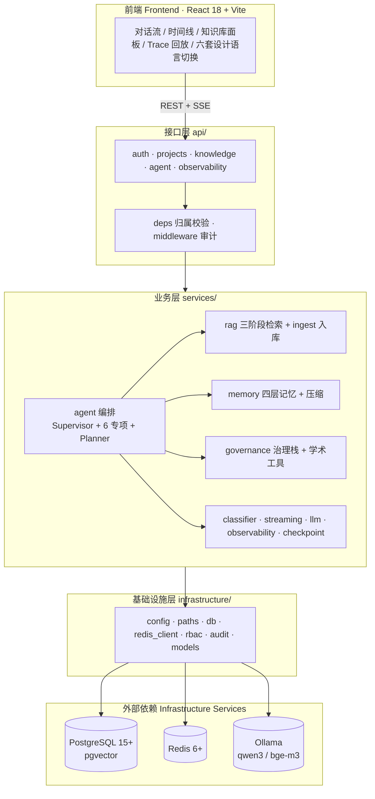
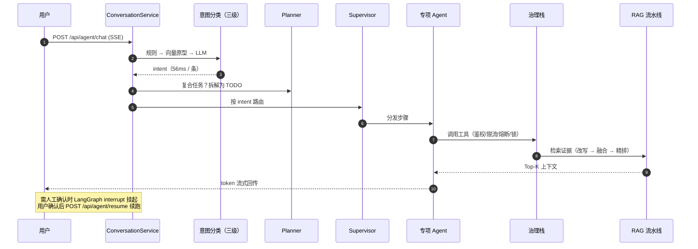

# 论匠 · LunJiang

<div align="center">

**多智能体驱动的毕业论文 / 学术论文全流程辅助平台**

*Multi-Agent Platform for the Full Academic Writing Lifecycle*

`选题` · `文献` · `写作` · `格式` · `查重` · `AI 检测`
一个 Supervisor 调度六类专项 Agent，覆盖从开题到答辩的完整链路

<br/>


**本地优先** · 对话与嵌入均走 Ollama（`qwen3:4b-ctx4096` + `bge-m3`），断网可跑，数据不出本机

</div>

---

## 目录 Table of Contents

| | |
| :--- | :--- |
| [一、项目简介 Introduction](#intro) | [七、目录结构 Project Layout](#layout) |
| [二、核心特性 Core Features](#features) | [八、API 速览 API Overview](#api) |
| [三、系统架构 Architecture](#architecture) | [九、评测与基线 Evaluation](#evaluation) |
| [四、快速开始 Quick Start](#quickstart) | [十、文档导航 Documentation](#docs) |
| [五、配置说明 Configuration](#configuration) | [十一、贡献指南 Contributing](#contributing) |
| [六、知识库使用 Knowledge Base](#knowledge) | [十二、常见问题 FAQ](#faq) · [十三、许可证 License](#license) |

---

<a id="intro"></a>

## 一、项目简介 Introduction

论匠把「写一篇论文」拆成一条可编排、可观测、可治理的工程流水线，而不是一个单纯聊天的对话框。

| 论文写作的真实痛点 | 论匠的解法 |
| :--- | :--- |
| 通用大模型不了解**你的**文献与草稿 | 项目级私有知识库：上传 PDF/DOCX/TXT/MD → 自动解析分块向量化，跨项目隔离 |
| 一个 prompt 干不完「查文献 + 写综述 + 排版」这类复合任务 | Plan-Execute-Replan 规划器拆解为 TODO，Supervisor 分发给专项 Agent，最大 3 跳防回环 |
| 工具调用失控：无限流、无审计、失败就崩 | 治理栈七层串联：RBAC → 限流 → 熔断 → 三级容错 → 分布式锁 → 审计 → 行为观测 |
| 上下文越聊越贵，长对话必然溢出 | 四层记忆 + 压缩（实测压缩比 **0.214**，目标 ≤ 0.3） |
| 结果不可信、过程不可追溯 | 全链路 Trace/Log/Memory/Action 统一 Span，支持树形回放与逐节点排查 |
| 需要人类拍板的环节 AI 自作主张 | LangGraph `interrupt` 挂起 → 前端确认 → `/resume` 续跑 |

> **设计取向**：可解释优先于"看起来聪明"。每一条结论都能回溯到命中的证据块、调用的工具与 Prompt。

---

<a id="features"></a>

## 二、核心特性 Core Features

| 能力 | 说明 | 关键实现 |
| :--- | :--- | :--- |
| **多智能体编排** | 1 个 Supervisor 调度 **6 类专项 Agent**（选题 / 文献 / 写作 / 格式 / 查重 / AI 检测）+ Plan-Execute-Replan 规划器，最大 3 跳防回环 | `services/agent/` |
| **三级意图分类** | 规则 → 向量原型 → LLM 兜底；实测 **22/22 = 100%**（规则层 16 / 向量层 6，LLM 未触发），平均 **56 ms/条** | `services/classifier/intent.py` |
| **项目级知识库** | 多格式上传 → 解析 → 分块 → 向量化入库；MD5 去重 / 扫描件拒绝 / 跨项目隔离；`project` 与 `hybrid` 双检索模式 | `services/rag/ingest/` |
| **三阶段 RAG** | 难度自适应 Query 改写（`off/auto/on` + 规则兜底 + 防漂移）→ 稠密 + 稀疏 + **相邻窗口**多路 RRF 融合 → 交叉精排降噪 | `services/rag/` |
| **结构化产物** | 文献综述初稿 / 开题报告 / 答辩大纲：模板骨架 + RAG 证据注入，而非自由生成 | `services/governance/artifacts.py` |
| **学术工具生态** | 翻译 / 润色 / 方法推荐 / 参考文献格式化（GB7714）/ 摘要生成 / 术语解析 | `services/governance/academic_tools.py` |
| **工具治理栈** | RBAC → 限流 → 熔断 → 三级容错（重试 / 降级 / 人机兜底）→ 分布式锁 → 审计 → 行为观测 → Skill；**14 个工具**统一纳管，同步 handler 自动线程池化 | `services/governance/` |
| **四层记忆** | 短期（Redis）/ 结构化 / 长期（pgvector）/ 偏好 + 压缩 | `services/memory/` |
| **SSE 流式** | EventHub 事件总线 + token 微缓冲，打字机式输出 | `services/streaming/hub.py` |
| **人机介入** | LangGraph `interrupt` 挂起 → `/resume` 续跑 | `api/agent/router.py` |
| **全链路可观测** | Trace / Log / Memory / Action 统一 Span，树形回放 | `services/observability/` |

<details>
<summary><strong>展开：治理栈一次调用的完整链路</strong></summary>

```
工具调用
  │
  ├─ 1. RBAC 鉴权 ────────── 角色无权限 → 直接拒绝
  ├─ 2. 限流 (令牌桶) ─────── 超出 rpm → 快速失败
  ├─ 3. 熔断检查 ──────────── 熔断开启 → 直接降级，不打到下游
  ├─ 4. 分布式锁 ──────────── 需互斥的工具跨实例互斥
  ├─ 5. 执行 + 三级容错 ───── 重试 → 降级参数 → 人机兜底
  ├─ 6. 审计落库 ──────────── 参数截断 + 指纹化，防敏感信息入日志
  └─ 7. 行为观测 ──────────── 写入 Trace Span，可回放
```

</details>

---

<a id="architecture"></a>

## 三、系统架构 Architecture

### 3.1 分层结构



> **依赖方向铁律**：`api → services → infrastructure → configs`，**禁止反向 import**。

### 3.2 一次提问的执行链路



---

<a id="quickstart"></a>

## 四、快速开始 Quick Start

### 4.0 环境依赖

| 依赖 | 版本要求 | 用途 | 默认连接地址 |
| :--- | :--- | :--- | :--- |
| Python | 3.11（推荐 conda 环境 `envs/lunjiang`） | 后端运行时 | — |
| Node.js | 18+（CI 用 22） | 前端构建（Vite 5） | — |
| PostgreSQL | 15+（含 **pgvector** 扩展） | 业务表 + 向量记忆 + 知识库 | `127.0.0.1:5433` |
| Redis | 6+ | 短期记忆 / 限流窗口 / 分布式锁 | `127.0.0.1:6379` |
| Ollama | 最新版 | 本地对话与嵌入模型 | `127.0.0.1:11434` |

> ⚠️ **必须先启动数据库**：应用启动时会在 lifespan 中立即连接 PostgreSQL 建表，否则后端直接失败（`ConnectionRefusedError: [WinError 1225]`）。

<details>
<summary><strong>方式 A：Docker 一键起依赖（推荐）</strong></summary>

```bash
docker compose up -d              # 启动 PostgreSQL(pgvector) + Redis
docker compose down               # 停止
docker compose down -v            # 停止并清空数据卷
```

起后端多实例（验证分布式锁与熔断状态共享）：

```bash
docker compose up -d --scale app=2   # 端口 8001 / 8002
```

</details>

<details>
<summary><strong>方式 B：本机原生启动（Windows / PowerShell 实测基线）</strong></summary>

```powershell
# 1) PostgreSQL（独立实例，端口 5433）
D:\Develop\DB\PostgreSQL16\Library\bin\pg_ctl -D D:\Develop\DB\PostgreSQL16\data start

# 2) Redis
redis-server

# 3) Ollama：新开窗口常驻
ollama serve
ollama pull bge-m3
ollama pull qwen3:4b
ollama create qwen3:4b-ctx4096 -f configs\ollama\Modelfile.qwen3-ctx4096
```

> `qwen3:4b-ctx4096` 是用 Modelfile 固化 `num_ctx=4096` 的镜像副本（blob 复用，几乎不占额外磁盘），用于防止 16 GB 内存机器上 KV Cache OOM。

连通性自检：`netstat -ano | findstr ":5433 :6379 :11434"` —— 看到 `LISTENING` 即正常。

</details>

### 4.1 安装

```powershell
conda create -p envs\lunjiang python=3.11 -y
conda run -p envs\lunjiang pip install -r requirements.txt -i https://pypi.tuna.tsinghua.edu.cn/simple
copy .env.example .env        # 按需修改 PG / Redis 连接与 SECRET_KEY
```

前端依赖：

```bash
cd frontend && npm install
```

### 4.2 初始化数据

```powershell
envs\lunjiang\python.exe scripts/check_env.py        # 连通性自检（Ollama/Redis/PG/pgvector）
envs\lunjiang\python.exe scripts/ingest_corpus.py    # data/corpus/*.txt 入库（--force 重建）
```

### 4.3 启动

```powershell
# 终端 1 · 后端
envs\lunjiang\python.exe -m uvicorn main:app --host 127.0.0.1 --port 8000

# 终端 2 · 前端（PowerShell 用 ; 分隔，不要用 &&）
cd frontend; npm run dev
```

打开 <http://localhost:5173> → 注册 → 登录 → 新建项目 → 发起对话。Swagger 文档：<http://127.0.0.1:8000/docs>。

### 4.4 验证安装

```powershell
envs\lunjiang\python.exe -m pytest tests/ -q        # 89 个离线用例，无需外部依赖
envs\lunjiang\python.exe scripts/smoke_governance.py # 治理栈自检（需 PG/Redis/Ollama）
```

预期输出（`check_env.py` 全绿基线）：

```text
== 论匠环境检查（LLM provider: ollama）==
[PASS] Ollama 对话模型 | qwen3:4b-ctx4096 -> 'OK'
[PASS] Ollama Embedding | bge-m3 向量维度=1024
[PASS] Redis | PING=True, SET/GET=ok
[PASS] PostgreSQL 连接 | 数据库 lunjiang 已存在
[PASS] pgvector 扩展 | vector 类型可用
结果: 5/5 通过
```

<details>
<summary><strong>展开：全部冒烟与评测命令</strong></summary>

```powershell
envs\lunjiang\python.exe scripts/smoke_memory.py       # 四层记忆 + 压缩（需 PG）
envs\lunjiang\python.exe scripts/smoke_rag.py          # 三阶段检索（需 PG+Ollama，语料已入库）
envs\lunjiang\python.exe scripts/smoke_governance.py   # 治理栈（需 PG/Redis/Ollama）
envs\lunjiang\python.exe scripts/smoke_trace.py        # Trace 回放（需 PG）
envs\lunjiang\python.exe scripts/smoke_graph.py        # Agent 图编译检查（需 LLM 底座可达）
envs\lunjiang\python.exe scripts/smoke_api.py --topic  # 端到端（需 uvicorn 已启动）
envs\lunjiang\python.exe evals/harness.py              # 三项指标评测（需 PG+Ollama）
envs\lunjiang\python.exe evals/regression.py           # 七大场景回归（需 PG+LLM 底座）
envs\lunjiang\python.exe scripts/load_test.py          # 知识库检索并发压测（需 uvicorn 已启动）
envs\lunjiang\python.exe -m ruff check .               # 静态检查
```

每个脚本的「通过特征」（成功时应看到的关键输出锚点）见 [📊 冒烟与评测基线报告](docs/EVALUATION_REPORT.md)。

</details>

---

<a id="configuration"></a>

## 五、配置说明 Configuration

三层配置：**`.env`（密钥与环境差异）→ `configs/settings.yaml`（主配置）→ `configs/*.yaml`（策略）**。

<details>
<summary><strong>5.1 <code>.env</code> —— 本地环境变量（不入库）</strong></summary>

> `.env` 缺失时配置层自动回退加载 `.env.example` 占位默认值（首次 clone 与 CI 可直接跑测试）；生产部署仍须复制后覆盖真实密钥。

| 变量 | 说明 |
| :--- | :--- |
| `SECRET_KEY` | JWT 签名密钥，**生产环境必须修改** |
| `APP_HOST` / `APP_PORT` / `APP_DEBUG` | 监听地址、端口与调试开关 |
| `PG_HOST` / `PG_PORT` / `PG_USER` / `PG_PASSWORD` / `PG_DB` | PostgreSQL 连接信息（本项目端口为 **5433**） |
| `REDIS_HOST` / `REDIS_PORT` / `REDIS_DB` | Redis 连接信息（默认 6379 / 0） |
| `DEEPSEEK_API_KEY` / `ZHIPU_API_KEY` / `QWEN_API_KEY` | 云底座密钥（切换 provider 时填写） |
| `AGNES_BASE_URL` / `AGNES_API_KEY` | 备选云底座 agnes-2.5-flash（OpenAI 兼容） |

</details>

<details>
<summary><strong>5.2 <code>configs/settings.yaml</code> —— 主配置</strong></summary>

- **对话 / 嵌入双底座解耦**：默认 `llm.default_provider=ollama`（本地 `qwen3:4b-ctx4096`，离线可用）、`llm.embedding_provider=ollama`（本地 `bge-m3`，1024 维）；`default_provider` 可切换 `deepseek` / `zhipu` / `qwen` / `agnes`。切换底座与 embedding 维度变更的后果见 [学习指南第 9 课](论匠学习指南.md)。
- **向量维度动态化**：pgvector 向量列维度由 `llm.providers.<底座>.embedding_dim` 动态决定（`infrastructure/config.get_embedding_dim()`），维度不符时运行时报错；已引入 Alembic 迁移骨架（`alembic/`），开发期沿用 `create_all` 兜底。
- **RAG 参数**：`rag.rewrite_enabled`（改写总开关）、`rag.rewrite_mode`（`off/auto/on`，默认 `auto`：短句跳过 LLM 仅走规则，口语化长尾才调 LLM）、`rag.sibling_window`（相邻窗口引擎半径，`0` = 关闭）、`rag.max_upload_size_mb`、`rag.knowledge.upload_dir`（默认 `data/uploads/`，已 gitignore）、`rag.knowledge.min_text_chars`（低于该字数视为扫描件拒绝）。

</details>

<details>
<summary><strong>5.3 <code>configs/tools.yaml</code> · <code>configs/rbac.yaml</code> —— 治理策略</strong></summary>

**`tools.yaml`**：14 个治理工具（论文 8 类 + 学术 6 类）各自的限流阈值（`rate_limit_rpm`）、熔断分组（`breaker`）与降级参数（`fallback_kwargs`）。例：`topic_analysis` 限流 10 rpm；`search_literature` 熔断分组 `rag_pipeline`，降级 `top_k=5`。

**`rbac.yaml`**：YAML 驱动的 RBAC，`resource` 命名 `<域>:<动作>`，支持 `*` 与 `prefix:*` 通配。

| 角色 | 权限 |
| :--- | :--- |
| `student` | 项目 CRUD、发起 / 介入 Agent 会话、全部论文工具（治理层另有限流与审计） |
| `admin` | 全量权限（含 Trace 回放） |
| `anonymous` | 仅注册与登录 |

</details>

---

<a id="knowledge"></a>

## 六、知识库使用 Knowledge Base

```http
POST /api/projects/{id}/knowledge            # 上传（PDF/DOCX/TXT/MD，支持多文件）
GET  /api/projects/{id}/knowledge            # 文档列表
DELETE /api/projects/{id}/knowledge/{doc_id} # 删除
POST /api/projects/{id}/knowledge/search     # 检索：mode=project（仅库内）| hybrid（公共语料 + 库内融合）
```

上传后自动完成解析 → 分块 → 向量化入库。详细调用示例见 [学习指南第 20 课](论匠学习指南.md)。

> **已知边界**：扫描版 PDF（无可提取文本）本期不支持 OCR，接口返回 `status=failed` 并附错误说明。请上传含文本层的 PDF 或 DOCX/TXT/MD。

---

<a id="layout"></a>

## 七、目录结构 Project Layout

```
Lun-Assistant/
├── main.py                  FastAPI 入口（uvicorn main:app）
├── api/                     接口层：路由 + 共享依赖 + 响应模型
│   ├── auth/                注册 / 登录 / JWT（/me 当前用户）
│   ├── projects/            论文项目 CRUD
│   ├── knowledge/           项目级私有知识库（上传 / 列表 / 删除 / 库内检索）
│   ├── agent/               /chat (SSE) 与 /resume 人机介入
│   ├── observability/       Trace 回放 + 运行指标（admin）
│   ├── deps.py              路由共享依赖（get_owned_project 归属校验）
│   └── middleware/          审计中间件（fire-and-forget）
├── services/                业务服务层（禁止 import api/，可独立测试）
│   ├── agent/               LangGraph 主从图 + specialists/（6 专项 Agent）+ planner + conversation_service
│   ├── rag/                 三阶段流水线（改写 / 多路召回 / 精排）+ ingest/（语料与知识库入库）
│   ├── memory/              四层记忆 + 压缩
│   ├── governance/          工具治理与实现（限流 / 熔断 / 重试 / 锁 / RBAC / Skill / 学术工具 / artifacts）
│   ├── classifier/          三级意图分类
│   ├── streaming/           事件总线（SSE 微缓冲）
│   ├── checkpoint/          三级降级检查点
│   ├── llm/                 LLM 统一接入（全项目统一 LLMProvider）
│   └── observability/       Trace Span
├── infrastructure/          基础设施层（地基，所有模块都经过它）
│   ├── config.py            settings.yaml + .env + 单例
│   ├── paths.py             路径常量单一真源
│   ├── db.py / redis_client.py
│   ├── audit.py             审计写库（参数截断 + 指纹化）
│   ├── rbac/                角色策略
│   └── models/              ORM（users / projects / memory / trace / audit / skill / knowledge）
├── configs/                 settings.yaml · rbac.yaml · tools.yaml · ollama/Modelfile
├── data/                    corpus/（公共语料）+ uploads/（知识库原始文件，已 gitignore）
├── evals/                   评测 Harness + A/B + 七大场景回归 + 报告图表
├── scripts/                 初始化 + 冒烟 + 压测脚本
├── tests/                   离线单元测试（89 用例，无外部依赖）
├── frontend/                React 18 + Vite（落地页 ×6 + 工作台 / SSE 对话 / 时间线 / 知识库 / Trace / 六套设计语言）
├── docs/                    文档（学习指南 / 优化记录 / 前端版本线 frontend-versions/）
├── alembic/                 SQLAlchemy 迁移（异步 env.py 聚合全部模型）
├── docker-compose.yml       PostgreSQL(pgvector) + Redis + app 编排（--scale app=2 起多实例）
└── Dockerfile               后端镜像（python:3.12-slim，非 root + /health 健康检查）
```

---

<a id="api"></a>

## 八、API 速览 API Overview

| 分组 | 端点 | 鉴权 |
| :--- | :--- | :--- |
| **Auth** | `POST /api/auth/register`、`POST /api/auth/login`、`GET /api/auth/me` | 前两者免鉴权；`/me` 需 Bearer |
| **Projects** | `POST/GET /api/projects`、`GET/PATCH/DELETE /api/projects/{id}` | Bearer |
| **Knowledge** | `POST/GET/DELETE /api/projects/{id}/knowledge[/{doc_id}]`、`POST .../knowledge/search` | Bearer |
| **Agent** | `POST /api/agent/chat`（SSE 流式）、`POST /api/agent/resume` | Bearer |
| **Trace** | `GET /api/observability/traces`、`GET /api/observability/traces/{trace_id}`、`GET /api/observability/metrics` | admin |

完整交互式文档：启动后端后访问 <http://127.0.0.1:8000/docs>。

---

<a id="evaluation"></a>

## 九、评测与基线 Evaluation

> 数据为 **2026-09-04 全本地 CPU 底座**（`qwen3:4b-ctx4096` + `bge-m3` + `bge-reranker-base`）一次完整跑通快照，**非理想环境下的最好成绩**。完整明细与通过特征见 [📊 冒烟与评测基线报告](docs/EVALUATION_REPORT.md)。

| 项目 | 结果 | 说明 |
| :--- | :--- | :--- |
| 离线单测 | **89 passed** | `pytest tests/ -q`，无外部依赖 |
| 冒烟脚本 | **11 / 11 通过** | check_env 5/5；记忆 / RAG / 治理 / Trace / 图 / API 全绿 |
| 意图分类准确率 | **22 / 22 = 100%** | 规则层 16 / 向量层 6 / LLM 兜底 0；平均 56 ms/条 |
| RAG Recall@5（简单集） | **100%** | 含主题关键词的查询 |
| RAG Recall@5（口语长尾集） | **80%** | 刻意避开语料关键词；引入 `_TOPIC_POOL` 主题词表后由 62.5% 提升 |
| RAG Recall@5（学术刁钻集） | **95%** | 学术表述 + 术语改写 |
| 泛化能力（hold-out） | **6 / 8 = 75%** | 8 条未见口语查询，**仍有提升空间** |
| 记忆压缩比 | **0.214** | 目标 ≤ 0.3 |
| 回归测试（七大场景） | **16 / 16 PASS** | 入库去重 / 跨项目隔离 / RRF 融合 / 改写回退 / 治理 / 记忆 / Trace |
| 并发压测 | 成功率 **100%**，QPS **1.9**，P95 **5574 ms** | CPU 底座，延迟主要来自本地推理 |

我们刻意保留不完美的数字：长尾集 80% 与 hold-out 75% 说明 Query 改写机制有效但尚未收敛，这是本项目当前最明确的优化方向。

---

<a id="docs"></a>

## 十、文档导航 Documentation

> ⚠️ **变更标注（2026-09-02 · 文档治理轮）**：前端版本演进文档（v8 → v15）已统一归入 [`docs/frontend-versions/`](docs/frontend-versions/README.md)。统一格式规范见 [`docs/FORMAT_STANDARD.md`](docs/FORMAT_STANDARD.md)。

**入门必读**

| 文档 | 用途 |
| :--- | :--- |
| [📖 学习指南（合并版）](论匠学习指南.md) | **唯一学习主文档**（2026-09-30 由《学习指南》+《学习路径》合并）。第零部分总览（简介 / 术语 / 目录 / 模块地图）→ 第一部分设计认知 → 第二部分五阶段进阶（第 4~28 课，设计课+实现课配对）→ 第三部分复现收尾 → 七附录（含 FAQ / 知识映射 / 自检 / 知识缺口自评） |
| [📊 冒烟与评测基线](docs/EVALUATION_REPORT.md) | 复现命令、通过特征与实测基线，排障与面试演示对照 |
| [🚀 部署指南](docs/DEPLOY.md) | GitHub Pages 自动部署（前端视觉预览） |

**工程与架构**

| 文档 | 用途 |
| :--- | :--- |
| [📐 目录结构审查](docs/ARCHITECTURE_REVIEW.md) | 目录合理性评估（问题清单 + 优化建议） |
| [📂 项目结构说明](docs/PROJECT_STRUCTURE.md) | 目录与关键文件用途说明 |
| [📐 统一格式规范](docs/FORMAT_STANDARD.md) | 全部 Markdown 文档的格式规范 |
| [🛠 优化记录](docs/OPTIMIZATION_ROUND1.md) | Round 1–6：性能 / OOM / 前端排障 / RAG / 学术工具 / 工程化治理 |
| [🛠 优化记录十二 / 十三](docs/OPTIMIZATION_ROUND12.md) | CI 静态检查 / 依赖锁定 / 前端 Hooks / 可移植性；审计合规 / 改写自适应 / 记忆排序 / 多实例部署 |

**前端版本线**（[总索引](docs/frontend-versions/README.md) · v8 → v15）

| 版本 | 文档 | 内容 |
| :--- | :--- | :--- |
| v8 | [视觉三方向提案](docs/frontend-versions/VISUAL_DIRECTIONS.md) | 青绿长卷 / 水墨改良 / 暗墨金线 |
| v9 | [设计规范](docs/frontend-versions/DESIGN_SPEC.md) · [Round 7](docs/frontend-versions/OPTIMIZATION_ROUND7.md) | 青绿长卷设计令牌 · 会话卷册 / 山水浓度滑杆 |
| v10 | [Round 8](docs/frontend-versions/OPTIMIZATION_ROUND8.md) · [9](docs/frontend-versions/OPTIMIZATION_ROUND9.md) · [10](docs/frontend-versions/OPTIMIZATION_ROUND10.md) | 三主题切换 · WebP 压缩 5.32→0.26 MB + Pages 部署 · 遗留项落地 |
| v11 | [变更（设计稿侧）](docs/frontend-versions/CHANGELOG-v11-design.md) · [（生产侧）](docs/frontend-versions/CHANGELOG-v11-frontend.md) | 四主题 A / B / C / D |
| v12 | [变更](docs/frontend-versions/CHANGELOG-v12.md) · [Round 11](docs/frontend-versions/OPTIMIZATION_ROUND11.md) | B 主题翻转为黑白瑞士（修复 B↔D 区分度） |
| v13 | [变更](docs/frontend-versions/CHANGELOG-v13.md) | 新增三主题 E 雨过天青 / F 玄墨赭金 / G 秋香宣纸（反 AI 味设计 · 现有主题零改动） |
| R15 | [Round 15](docs/frontend-versions/OPTIMIZATION_ROUND15.md) | 落地页门面（静态多页 · 双主题 · 零依赖），工作台入口迁 app.html |
| v14 | [变更](docs/frontend-versions/CHANGELOG-v14.md) · [Round 16](docs/frontend-versions/OPTIMIZATION_ROUND16.md) | 顶栏容量修复（五档减法）· 落地页 mock 化（替换过时截图）· tuner 追平七主题 · a11y 补强 |
| v15 | [变更](docs/frontend-versions/CHANGELOG-v15.md) · [Round 17](docs/frontend-versions/OPTIMIZATION_ROUND17.md) | 现代艺术四主题 H 墨格编辑部 / I 新构成主义 / J 夜航诗意 / K 拓印套色（工作台 11 主题共存）· 落地页编辑部双结构（6 主题）· web 字体接入 |
| R18 | [Round 18](docs/frontend-versions/OPTIMIZATION_ROUND18.md) | 落地页一致性修复（编辑部版式补齐 · 导航 / 主题入口 / 锚点 / 顶栏对齐）· 三枚彩蛋机关（编队调度局 / 查重捉虫 / 临帖墨试） |
| v18 | [变更](docs/frontend-versions/CHANGELOG-v18.md) | **六套设计语言（推翻重来）**：铅字印刷 / 夜航仪表 / 学术海报 / 木牍竖排 / 孔版双色 / 索引档案。旧的「11 主题 + 柔化开关」体系整体删除，改为 `<html data-skin>` + 每皮肤一份完整样式；落地页每皮肤一个独立 HTML；业务逻辑与后端零改动 |

---

<a id="contributing"></a>

## 十一、贡献指南 Contributing

欢迎 Issue 与 PR。为保证主线稳定，请遵循以下约定。

### 11.1 开发流程

```bash
git clone https://github.com/shangguanyunji663/Lun-Assistant.git
cd Lun-Assistant
conda create -p envs/lunjiang python=3.11 -y     # 或使用现有虚拟环境
conda run -p envs/lunjiang pip install -r requirements.txt
```

1. **Fork 并新建分支**：`feat/<主题>` / `fix/<问题>` / `docs/<主题>` / `refactor/<范围>`。
2. **小步提交**：一个 PR 只做一件事，避免把重构与功能改动混在一起。
3. **提交信息**：新提交建议用 Conventional Commits（`feat:` / `fix:` / `docs:` / `refactor:` / `test:` / `chore:`）。历史提交未严格遵循，不强求回溯。
4. **提交前自检**（见 11.3 清单）。
5. **发起 PR**：在描述中写明 **改动背景 / 涉及模块 / 验证结果**，并粘贴关键命令输出（冒烟脚本或 pytest 结果）。

### 11.2 代码与架构约定

| 约定 | 说明 |
| :--- | :--- |
| 依赖方向 | `api → services → infrastructure → configs`，**禁止反向 import** |
| 服务层独立性 | `services/` 不得 import `api/`，保证可脱离 HTTP 层测试 |
| 路径单一真源 | 路径常量统一走 `infrastructure/paths.py`，禁止硬编码相对路径 |
| 新增工具 | 必须在 `configs/tools.yaml` 注册（限流 / 熔断 / 降级参数），并经治理栈调用，**不要绕过治理直接调 LLM** |
| 新增配置项 | 写入 `configs/settings.yaml` 并在 README「配置说明」同步登记 |
| 类型与静态检查 | `mypy` 仅强制已写注解的代码（`pyproject.toml` 配置），`ruff` 规则见 `ruff.toml` |
| 文档 | 文档格式见 `docs/FORMAT_STANDARD.md`；前端版本演进写入 `docs/frontend-versions/`（套用 `TEMPLATE.md`） |
| CI 范围 | 当前 CI（`.github/workflows/deploy.yml`）仅覆盖前端 eslint + build + Pages 部署；**后端检查请在本地执行** |

### 11.3 提交前检查清单

- [ ] `python -m pytest tests/ -q` —— 89 用例全绿，新增功能需补充离线用例
- [ ] `python -m ruff check .` —— 无告警
- [ ] `python -m mypy`（可选，仅校验已注解代码）
- [ ] 涉及的冒烟脚本跑通（改动哪个子系统就跑对应 `scripts/smoke_*.py`）
- [ ] 若改动配置或目录结构，同步更新本 README 与 `docs/PROJECT_STRUCTURE.md`

---

<a id="faq"></a>

## 十二、常见问题 FAQ

<details>
<summary><strong>后端启动报 <code>ConnectionRefusedError: [WinError 1225]</code></strong></summary>

应用启动时会立即连接 PostgreSQL 建表，该错误说明 **PostgreSQL（或 Redis）未启动**。按 [快速开始 4.0](#quickstart) 的连通性自检确认监听，依次启动依赖后重启。

</details>

<details>
<summary><strong><code>pg_ctl start</code> 提示 another server might be running 并卡住</strong></summary>

多为异常退出残留 `postmaster.pid`。确认 5433 无监听、无 postgres 进程后，删除 `D:\Develop\DB\PostgreSQL16\data\postmaster.pid` 再启动。

</details>

<details>
<summary><strong>Ollama 返回 500（KV Cache OOM）</strong></summary>

确认使用的是 `qwen3:4b-ctx4096` 镜像（Modelfile 固化 `num_ctx=4096`）而非裸 `qwen3:4b`。创建命令见 [4.0 方式 B](#quickstart)。

</details>

<details>
<summary><strong>端口冲突（5433 / 6379 被占用）</strong></summary>

先释放端口，或同步调整 `.env` 与 `postgresql.conf` 保持一致。注意 `docker-compose.yml` 的宿主映射端口也要一起改。

</details>

<details>
<summary><strong><code>check_env.py</code> 报错</strong></summary>

该脚本按 Ollama `/api/generate` 格式探测 LLM 底座，默认 `default_provider=ollama` 可直测；若临时切换到 OpenAI 兼容云端（如 agnes）出现 404 属预期，以其他冒烟脚本与 `netstat` 端口检查为准。

</details>

<details>
<summary><strong>知识库上传返回 failed（扫描件）</strong></summary>

扫描版 PDF 无可提取文本，本期不支持 OCR，接口返回 `status=failed` 及错误说明。请上传含文本层的 PDF 或 DOCX/TXT/MD。

</details>

<details>
<summary><strong>中文乱码</strong></summary>

全部文件保持 UTF-8（已配 `.editorconfig` + IDE settings）。

</details>

---

<a id="license"></a>

## 十三、许可证 License

本项目基于 **[MIT License](LICENSE)** 开源。

```
Copyright (c) 2026 吴国伟（shangguanyunji663）

Permission is hereby granted, free of charge, to any person obtaining a copy
of this software and associated documentation files (the "Software"), to deal
in the Software without restriction, including without limitation the rights
to use, copy, modify, merge, publish, distribute, sublicense, and/or sell
copies of the Software, and to permit persons to whom the Software is
furnished to do so, subject to the following conditions:

The above copyright notice and this permission notice shall be included in all
copies or substantial portions of the Software.

THE SOFTWARE IS PROVIDED "AS IS", WITHOUT WARRANTY OF ANY KIND, EXPRESS OR
IMPLIED, INCLUDING BUT NOT LIMITED TO THE WARRANTIES OF MERCHANTABILITY,
FITNESS FOR A PARTICULAR PURPOSE AND NONINFRINGEMENT.
```

**使用边界提示**：本项目旨在辅助学术写作流程，**不替代学术判断**。查重降重与 AI 检测结果仅为参考值，请遵守所在院校的学术诚信规范。

---

<div align="center">

**论匠 · LunJiang** · 用工程方法写论文

如果这个项目对你有帮助，欢迎 Star ⭐ 或提 Issue 交流。

</div>
