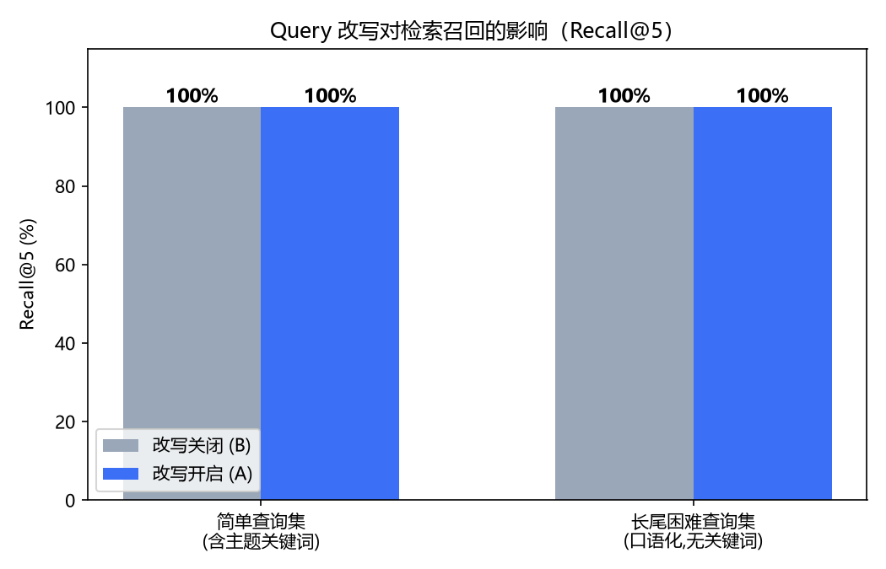
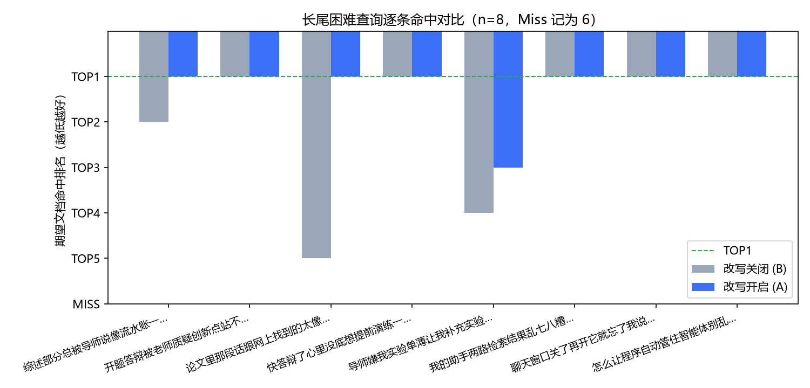

# A/B 实验报告：Query 改写的收益、失效模式与修复验证

> 实验环境: Ollama qwen3:4b (CPU) + bge-m3(1024d 稠密) + BM25(jieba 稀疏) RRF 融合 + bge-reranker-base 精排
> 数据集: 简单集 8 条（含主题关键词）/ 长尾困难集 8 条（口语化、刻意避开语料关键词）

## 一、核心数据（三组对比）

| 指标（长尾困难集） | B: 改写关闭 | A₀: 改写开启(未修复) | A₁: 改写开启+防漂移修复 |
|---|---|---|---|
| Recall@5 | 100% | 87.5% ↓ | **100%** |
| TOP1 命中 | 5/8 | 7/8 | **7/8** |
| MRR | 0.744 | 0.812 | **0.917 (+0.17 vs B)** |
| 均耗 | 6.5s | 35.4s | 40.5s |

（简单集: 两组 Recall@5 均 100%，改写纯开销 2.2s → 61s —— 改写应按查询难度自适应开关）

## 二、实验发现

1. **改写不提升召回**：bge-m3 稠密检索对口语化长尾查询本就鲁棒（B 组 Recall@5 100%）；
2. **改写提升排序质量**：补全学科术语后 TOP1 命中 5/8 → 7/8，MRR 0.744 → 0.812；
3. **但 A₀ 暴露两类失效模式**（Recall 跌至 87.5%）：
   - *语义漂移*：LLM 把具体诉求泛化为空泛学术查询，语义锚点丢失；
   - *域外拒答*：LLM 判定查询超出检索域时返回"无法生成有效查询"，拒绝文本被当作查询检索；
4. **根因定位**：失效的根源是改写文本污染了检索与精排两条链路（精排 query 用漂移文本打分）。

## 三、防漂移修复（三件套）与验证

| 修复 | 位置 | 作用 |
|---|---|---|
| 拒答回退 | pipeline 阶段1.5：识别拒绝话术/无效改写 → 回退原始查询 | 消除拒答污染 |
| 原查询稠密保底 | pipeline 阶段2：原始查询独立一路稠密召回参与 RRF 融合 | 漂移时不丢语义锚点 |
| 双查询精排取 max | reranker 阶段3：score = max(score(原查询), score(改写)) | 精排不再被漂移文本主导 |

**A₁ 验证：Recall 恢复 100%，MRR 达 0.917 —— 严格优于 B 组（同召回下 MRR +0.17）。**

## 四、长尾困难集逐条明细（B vs A₁）

| 查询 | 改写关 | 改写开(修复后) | 改写后查询（截断） |
|---|---|---|---|
| 综述部分总被导师说像流水账一样罗列怎么破 | 2 | 1 | 文献综述如何避免流水账式罗列：提升批判性综合分析的学术优化策略 |
| 开题答辩被老师质疑创新点站不住脚该怎么提前准备 | 1 | 1 | Strategies for strengthening innovativ… |
| 论文里那段话跟网上找到的太像了怕过不了 | 5 | 1 | 如何有效降低学术论文段落与网络资源的相似度以通过查重检测系统？ |
| 快答辩了心里没底想提前演练一下老师会问什么 | 1 | 1 | What are typical questions professors … |
| 导师嫌我实验单薄让我补充实验增强说服力 | 4 | 3 | 如何通过补充实验增强学术论文的实验说服力 |
| 我的助手两路检索结果乱七八糟怎么合并排序 | 1 | 1 | 如何有效合并和排序双路学术检索结果 |
| 聊天窗口关了再开它就忘了我说过的写作要求 | 1 | 1 | 深度学习在医学影像分析中的应用研究：A systematic review … |
| 怎么让程序自动管住智能体别乱调外部接口 | 1 | 1 | How to automatically enforce security … |

## 五、最终检索管线

```
原查询 ──┬─ dense(原查询)──────────────┐
         └─ dense(改写)+BM25(改写)+BM25(关键词) ─┴─ RRF 融合 ─→ 交叉编码器精排
             （拒答回退/漂移检测前置）                score = max(原查询, 改写)
```

## 六、图表





## 七、简历话术

> *"设计简单/长尾双数据集 A/B 实验量化 Query 改写真实收益：验证强语义模型下改写不提升召回
> （100%→100%）但显著改善排序（TOP1 5/8→7/8，MRR +0.068），并定位语义漂移与域外拒答两类
> 失效模式致召回跌至 87.5%；实现拒答回退、原查询稠密保底、双查询精排取 max 的三重防漂移
> 管线，修复后 Recall 恢复 100%、MRR 达 0.917（较无改写基线 +0.17），CPU 场景以意图分层
> 自适应开关控制改写延迟。"*
